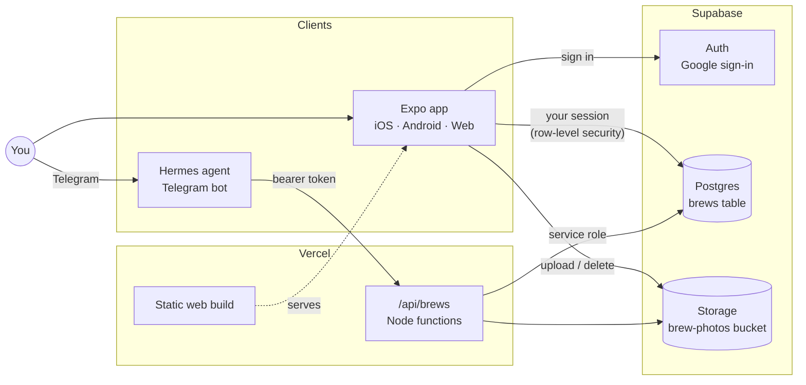
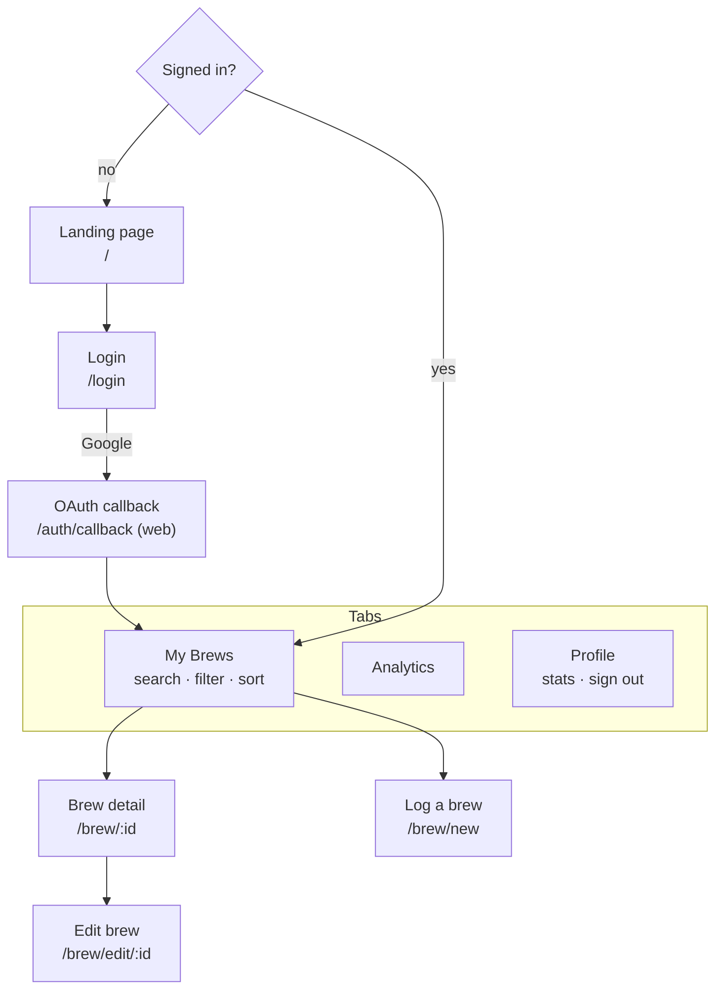
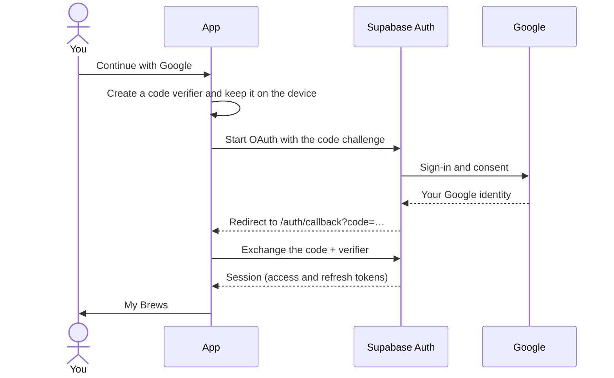
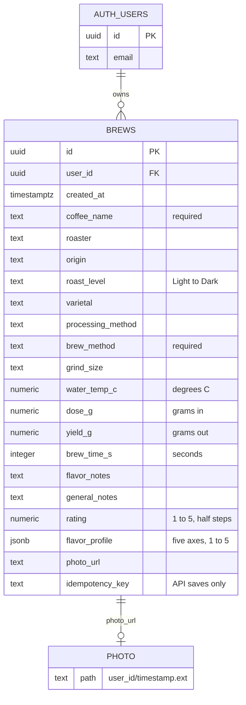
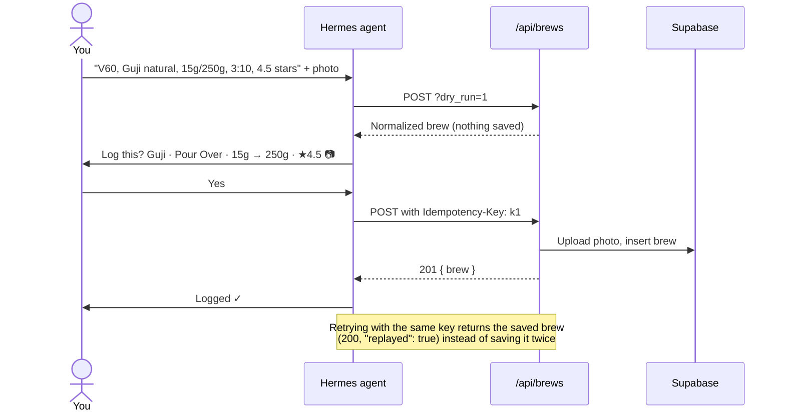
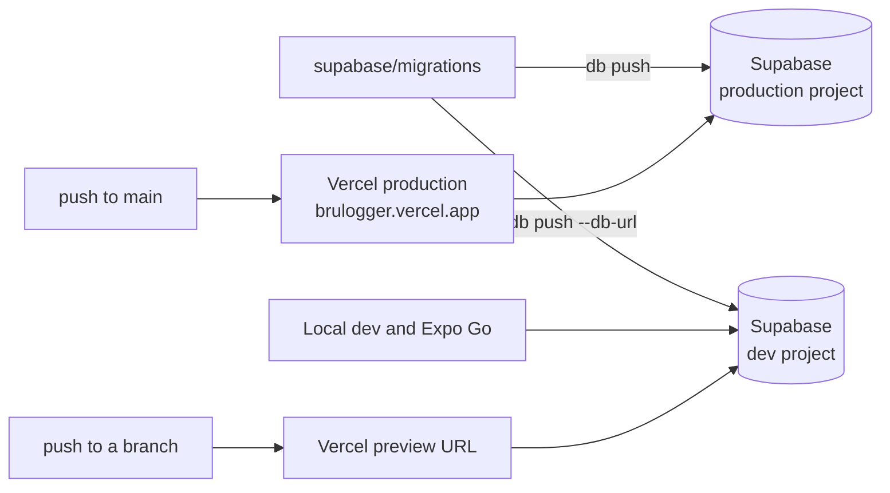

# BruLogger

A personal coffee journal. Log every brew (the coffee, the recipe, how it tasted), rate it, add a photo, and see how your taste changes over time. You can also log brews by messaging a Telegram bot.

Live at **[brulogger.vercel.app](https://brulogger.vercel.app)**. The same codebase runs on iOS, Android and the web.

- [Features](#features)
- [Architecture](#architecture)
- [The app](#the-app)
- [Data model](#data-model)
- [Security](#security)
- [HTTP API (Telegram bot)](#http-api-telegram-bot)
- [Development](#development)
- [Database migrations](#database-migrations)
- [Environments and deployment](#environments-and-deployment)
- [Project layout](#project-layout)

## Features

- **Log a brew**: the coffee (name, roaster, origin, roast level, varietal, processing), the recipe (method, grind, water temperature, dose, yield, brew time), tasting notes, a 1–5 star rating in half stars, and a photo.
- **Flavor profile**: score aromatics, acidity, sweetness, aftertaste and body from 1 to 5, shown as a radar chart. It's optional, so averages only include brews you actually scored.
- **Browse your history**: search by coffee, roaster, origin or flavor notes; filter by method, roast or minimum rating; sort by date, rating or name.
- **Analytics**: total brews, average rating, favorite method, rating over time, brews by method and roast level, and your average flavor profile.
- **Log from Telegram**: send the bot something like *"V60, Guji natural, 15g/250g, 3:10, blueberry, 4.5 stars"*, a photo of the bag, a photo of the cup, or any mix. It drafts the brew, asks you to confirm, and saves it. It can also fix or delete a logged brew and answer questions about past ones.
- **Private**: you sign in with Google, and each account sees only its own brews.

## Architecture

There is no custom backend for the app. It talks directly to Supabase, and Postgres row-level security keeps each user's data separate. The only server code is a small HTTP API on Vercel for the Telegram bot.



| Piece | Built with |
| --- | --- |
| App | [Expo](https://expo.dev) SDK 57 (React Native 0.86, React 19), [Expo Router](https://docs.expo.dev/router/introduction/), React Native Web |
| Data fetching | [TanStack Query](https://tanstack.com/query) on top of [supabase-js](https://supabase.com/docs/reference/javascript) |
| Charts | Hand-drawn with `react-native-svg` (no chart library) |
| Backend | [Supabase](https://supabase.com): Postgres, Auth (Google OAuth), Storage |
| Hosting and API | [Vercel](https://vercel.com): the static web build plus Node functions in `api/` |
| Telegram bot | A [Hermes](https://github.com/NousResearch/hermes-agent) agent with the skill in [`integrations/hermes/log-brew`](integrations/hermes/log-brew/SKILL.md) |

## The app

### Screens

The root layout (`app/_layout.tsx`) acts as an auth gate. Signed-out visitors can only reach the landing page, the login screen and the OAuth callback; signed-in users go straight to their brews.



Logging and editing a brew use the same form (`components/BrewForm.tsx`).

### Data loading

Screens never query Supabase themselves. They use the hooks in `lib/brewQueries.ts`, which wrap the data-access functions in `lib/brews.ts`:

- **One shared list.** All three tabs read the same cached `brews` query, so switching tabs doesn't refetch anything. Opening a brew shows the cached row right away.
- **Staying fresh.** Data older than 30 seconds is refetched when a screen or the app regains focus, which is how brews logged from Telegram appear.
- **Writes.** Creating, editing and deleting update the cache directly. When a brew's photo is replaced or the brew is deleted, the old photo file is deleted, but only after the database write succeeds.
- **Photos.** A picked photo is shrunk before upload (`lib/photos.ts`): longest edge 1600 px, re-encoded as JPEG at 0.8 quality. HEIC and PNG photos get converted along the way.

### Sign-in

Sign-in is Google-only, through Supabase Auth with the PKCE flow. The redirect carries a one-time code that only the device that started the sign-in can exchange, never the tokens themselves.



On the web, the browser returns to `/auth/callback` and supabase-js does the exchange there. On iOS and Android, the login screen opens an in-app browser, receives the `brulogger://auth/callback?code=…` redirect, and does the exchange itself. On native, the session token's refresh timer is restarted whenever the app comes back to the foreground.

## Data model

Each Brew is one row in `public.brews`, owned by a Supabase Auth user. A photo is a file in the public `brew-photos` storage bucket, stored under the owner's user ID and linked by its public URL. For what each domain term means, see the [glossary](CONTEXT.md).



| Field | Rules |
| --- | --- |
| `brew_method` | Required. One of Pour Over, French Press, Espresso, AeroPress, Cold Brew, Other. |
| `roast_level` | Light, Medium-Light, Medium, Medium-Dark or Dark. |
| `rating` | 1–5 in half steps. |
| `flavor_profile` | `{ aromatics, acidity, sweetness, aftertaste, body }`, each 1–5 in half steps. All five axes or none. |
| `idempotency_key` | Set by the API when a save is retried; unique per user. The app leaves it empty. |

Every optional column is `null` when unset. To clear a field on update, send `null`; a missing key leaves the old value in place.

The schema lives in [`supabase/migrations/`](supabase/migrations), and `types/database.ts` is generated from the live database. `types/index.ts` builds the app's `Brew` type on top of it, narrowing the columns Postgres only knows as text or JSON (`brew_method`, `roast_level`, `flavor_profile`).

## Security

- **Row-level security** on `brews`: a signed-in user can read, create, update and delete only rows whose `user_id` is their own, and can't move a brew to another user.
- **Storage policies** on `brew-photos`: users can upload, list and delete only files in their own folder. Photos are viewable by anyone who has the URL, which is what lets the app display them without signing every request.
- **The anon key** in the app is public by design. It grants nothing beyond what row-level security allows.
- **The bot API** uses a single bearer token that maps to one configured user, and writes with Supabase's service role key, which bypasses row-level security. So the API handlers themselves limit every query to that user. The token is compared in constant time.

## HTTP API (Telegram bot)

The API exists so an agent can log brews on your behalf without a browser sign-in. It's single-user: one token, one account.



### Authentication

Send `Authorization: Bearer <BRULOGGER_API_TOKEN>` with every request. A missing or wrong token gets `401`.

### Endpoints

| Method and path | What it does | Success |
| --- | --- | --- |
| `GET /api/brews` | Brews, newest first. Query: `limit` (default 10, max 50), `since` (ISO 8601), `q` (case-insensitive match on coffee name, roaster or origin). | `200 { "brews": [...] }` |
| `POST /api/brews` | Creates a brew. Add `?dry_run=1` to validate and normalize without saving. | `201 { "brew": {...} }` |
| `GET /api/brews/:id` | One brew. | `200 { "brew": {...} }` |
| `PATCH /api/brews/:id` | Changes only the fields sent; `null` clears a field. | `200 { "brew": {...} }` |
| `DELETE /api/brews/:id` | Deletes the brew, then its photo. | `200 { "deleted": {...} }` |

An `:id` that doesn't exist, belongs to someone else or isn't a valid UUID gets `404`.

### Request body

Brew fields use the column names from the [data model](#data-model). Input is forgiving where an agent is likely to vary, and strict where a mistake would otherwise be silent:

- Enum values match loosely: `"pour over"`, `"pour-over"` and `"Pour Over"` are all accepted.
- Numbers can be sent as strings, with a comma or a dot as the decimal separator. `brew_time_s` is rounded to whole seconds, and `rating` and flavor scores to half steps.
- Unknown fields are rejected, so a typo like `"dose"` instead of `"dose_g"` fails instead of being dropped.
- `created_at` is optional (it defaults to now) and can't be in the future.
- A photo is sent as `"photo": { "data": "<base64>", "mime_type": "image/jpeg" }`. JPEG, PNG, WebP and HEIC are accepted, up to 3 MB decoded, which keeps the request under Vercel's 4.5 MB limit. In a `PATCH`, `"photo": null` removes the photo.
- A `PATCH` can change `coffee_name`, `brew_method` and `created_at`, but can't clear them.

### Safe retries

Send an `Idempotency-Key` header (1–255 characters) with each `POST`, generated once per brew. If the request times out and is sent again with the same key, the API returns the brew it already saved (`200`, `"replayed": true`) instead of creating a duplicate. This also holds when two requests with the same key arrive at the same moment.

### Errors

```json
{ "error": "Invalid brew.", "details": ["brew_method must be one of: Pour Over, French Press, Espresso, AeroPress, Cold Brew, Other."] }
```

A `400` means nothing was written. Fix the fields named in `details` and retry.

### Example

```sh
curl -sS -X POST "https://brulogger.vercel.app/api/brews" \
  -H "Authorization: Bearer $BRULOGGER_API_TOKEN" \
  -H "Content-Type: application/json" \
  -H "Idempotency-Key: $(uuidgen)" \
  --data '{"coffee_name": "Guji Hambela", "brew_method": "pour over", "dose_g": 15, "yield_g": 250, "brew_time_s": 190, "rating": 4.5}'
```

### The Telegram agent

The agent's instructions are in [`integrations/hermes/log-brew/SKILL.md`](integrations/hermes/log-brew/SKILL.md): how to read a message or photo into a brew, when to ask, and the confirm-then-save workflow. The repo copy is the source of truth. After changing it, copy it into the Hermes agent's skills directory (`~/.hermes/skills/productivity/log-brew/` for the user Hermes runs as) and restart the agent.

## Development

### Prerequisites

- Node.js 20.19.4 or newer (Vercel builds with Node 24)
- A Supabase project to develop against (see [Environments](#environments-and-deployment))
- To run on a phone: [Expo Go](https://expo.dev/go) for SDK 57. For native builds, Xcode (iOS, macOS only) or the Android SDK.

### Setup

```sh
npm ci
```

On Linux distributions with a system libvips (for example Arch), `sharp` (used only by the icon script) tries to build from source and fails. In that case install with `SHARP_IGNORE_GLOBAL_LIBVIPS=1 npm ci`.

Create `.env.local` with the Supabase project the app should use:

```sh
EXPO_PUBLIC_SUPABASE_URL=https://<project-ref>.supabase.co
EXPO_PUBLIC_SUPABASE_ANON_KEY=<anon key>
```

If you have access to the Vercel project, `vercel env pull .env.local` fills these in with the development project's values.

### Running

| Command | What it does |
| --- | --- |
| `npm run web` | Dev server for the web app |
| `npm start` | Dev server for Expo Go. Scan the QR code with your phone. |
| `npm run ios` / `npm run android` | Native build on a simulator or device |

Notes for running on a phone:

- **Expo Go:** for an SDK 57 project, you have to be logged into the same Expo account in the CLI (`npx expo login`) and in the Expo Go app.
- **Redirect URLs:** Google sign-in needs the app's redirect allowed under the Supabase project's Authentication → URL Configuration: `exp://**` for Expo Go, `brulogger://**` for native builds.

### Checks

```sh
npm test            # Jest
npm run typecheck   # TypeScript, strict
npm run lint        # expo lint (ESLint 9)
npx expo export --platform web   # production web build into dist/
```

The tests cover the pure helpers (list filtering, stats, form parsing, input validation, photo sizing), the data-access layer and the API handlers, with Supabase mocked. There are no component tests; screens are kept thin so the logic lives in tested modules.

## Database migrations

The schema is managed with the [Supabase CLI](https://supabase.com/docs/guides/local-development/cli/getting-started), which is a dev dependency, so run it with `npx supabase`. Never edit a migration that has already been applied.

```sh
npx supabase migration new add_grinder </dev/null   # creates supabase/migrations/<timestamp>_add_grinder.sql
# write the SQL, then apply it (reads SUPABASE_DB_PASSWORD):
npx supabase db push                                  # the linked project
npx supabase db push --db-url "postgresql://…"       # any other project, e.g. the dev one
npm run db:types                                      # regenerate types/database.ts
```

The `</dev/null` matters: when stdin isn't a terminal, `migration new` reads the migration body from it and waits.

To add, rename or remove a Brew field, follow the checklist in [`.claude/skills/add-brew-field`](.claude/skills/add-brew-field/SKILL.md). A field touches the migration, types, form, detail screen, API validation and the bot's skill.

## Environments and deployment

Vercel is connected to GitHub. Every push to `main` deploys to production; every other branch gets its own preview URL. Previews and local development use a separate Supabase project, so they never touch real data.



**Vercel project settings:** Node 24.x, build command `npx expo export --platform web`, output directory `dist`. `vercel.json` sends every non-`/api` path to `index.html` so client-side routes work. Files in `api/` deploy as Node functions.

**Environment variables:**

| Variable | Used by | Environments |
| --- | --- | --- |
| `EXPO_PUBLIC_SUPABASE_URL` | App (built into the bundle) and API | Production; Preview and Development (dev project) |
| `EXPO_PUBLIC_SUPABASE_ANON_KEY` | App (built into the bundle) | Production; Preview and Development (dev project) |
| `SUPABASE_SERVICE_ROLE_KEY` | API | Production |
| `BRULOGGER_API_TOKEN` | API: the bot's bearer token | Production |
| `BRULOGGER_USER_ID` | API: the account the bot writes to | Production |

`EXPO_PUBLIC_*` values are compiled into the web bundle at build time, so changing one needs a redeploy. The dev Supabase project is on the free plan and pauses after a week without use. If a preview fails with `ERR_NAME_NOT_RESOLVED`, restore the project from the Supabase dashboard.

## Project layout

```text
app/                    Screens (Expo Router: one file per route)
  _layout.tsx           Auth gate, data cache provider
  index.tsx             Landing page
  (auth)/login.tsx      Google sign-in
  auth/callback.tsx     Finishes web sign-in
  (tabs)/               My Brews, Analytics, Profile
  brew/                 Detail, new, edit
components/             BrewForm, RadarChart, StarRating, SliderInput, icons
lib/
  brews.ts              Data access: the only place that queries Supabase
  brewQueries.ts        TanStack Query hooks used by screens
  brewList.ts           Search, filter, sort for My Brews
  analytics.ts          Stats and averages
  form.ts               Form values → save payload, with validation
  brewInput.ts          API input validation
  photos.ts             Resize before upload
  storage.ts            Photo bucket and path helpers
  supabase.ts           Supabase client
  theme.ts              Color and shadow tokens
api/brews/              Vercel functions: index.ts (list, create), [id].ts (get, update, delete)
server/api.ts           Shared API helpers: auth, responses, photos
types/                  Generated database types and the app's Brew types
supabase/migrations/    Database schema
integrations/hermes/    The Telegram agent's skill
__tests__/              Jest tests
scripts/                Icon generation
```

For agents working in this repo, [`CLAUDE.md`](CLAUDE.md) has the conventions and gotchas. [`CONTEXT.md`](CONTEXT.md) defines the domain terms.
